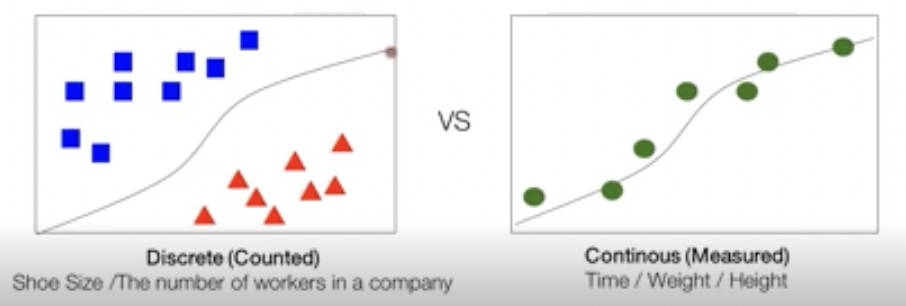

# Logistic Regression

## Binary Classification

-> result is (True or False) or (1 or 0)
=> That's what the result is decided on two options.

## Logistic vs Linear



> Logistic

- discrete
- countable

ex) sigmoid

> Linear

- Continuous
- Measured

## Procedure

x(input) -> Linear function -> Logistic function -> Decision Boundary -> Y {0, 1}

- decision boundary: Linear / non-linear decision boundary

## Code

```python

# result
Logistic_Y = [[0],[0],[0],[1],[1],[1]]
Linear_Y = [828.97769, 912.1254, 764.9768, 923.1856]

hypothesis = tf.matmul(X, θ) + b #linear θ is an [1xn+1] matrix / θ are parameters

hypothesis = tf.sigmoid(z)
hypothesis = tf.div(1., 1.+tf.exp(z))

predicted = tf.cast(hypothesis > 0.5, dtype = tf.int32)

```
