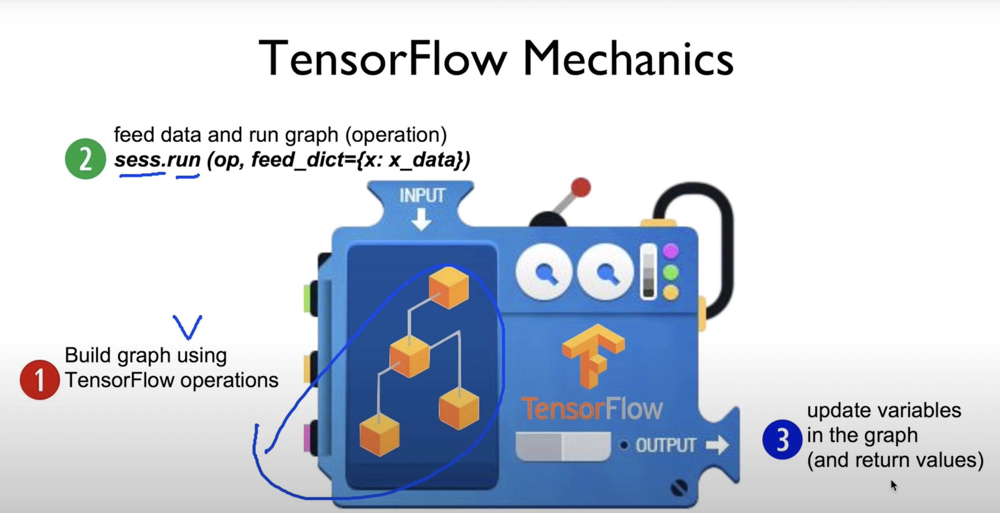

# 모두를 위한 딥러닝 2강

> -   Linear regression(2) tensorflow 구현

## tensorflow mechanism

텐서플로우는 텐서들의 연산을 통해 결과를 도출합니다.

텐서플로우가 동작하는 방식은 위 사진과 같은데요,

> 1. 텐서플로우 연산을 통해 그래프를 만들어낸다.
> 2. 그래프에 데이터를 넣고 그래프를 동작시킨다.(연산)
> 3. 그래프의 variable들을 업데이트시킨다. 그리고 값을 반환한다.

여기서 variable은 일반적인 프로그래밍에서의 변수의 의미와는 조금 다릅니다. tensorflow가 제어하는 trainable한 변수라고 볼 수 있습니다.
