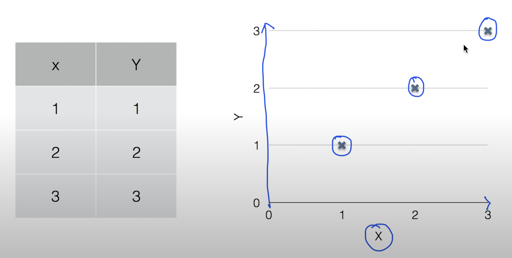
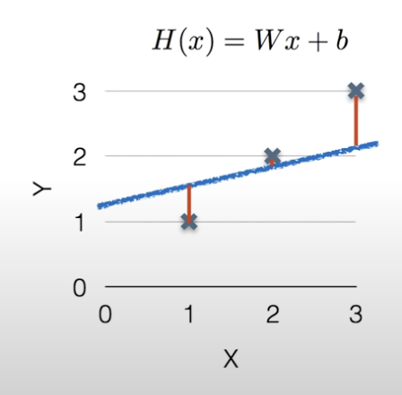
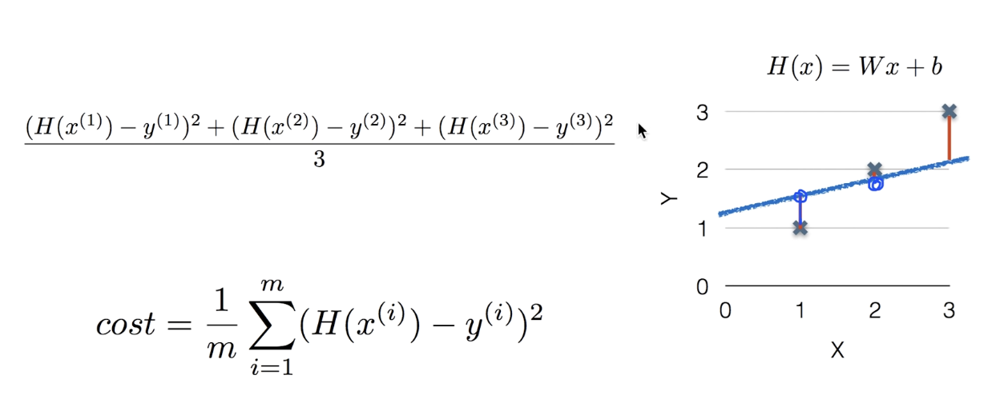
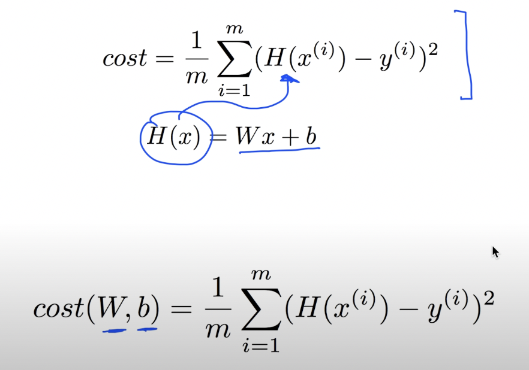

# 모두를 위한 딥러닝 2강

> -   Linear regression (선형 회귀)

## Linear regression

위의 사진 죄측의 표는 지도학습을 하기 위한 학습데이터입니다.

> x 값에 따라 y값이 유도된다고 보면 됩니다.

좌측의 표를 그래프에서 표현한다면 우측의 그래프처럼 표현됩니다.

이때 3개의 점을 따라 직선을 그을 수 있습니다.

linear regression이란, 훈련데이터들을 그래프상에 표현하여 각 점들을 이었을 때 만들어지는 선을 통하면 원하는 값이 나올 것이라는 가설을 세우는 것을 말합니다.

Linear regression을 통하면 다양한 선형 함수가 나오는데, 이 형태는

> H(x) = wx + b

위와 같은 1차함수 형태입니다.

## Which Hypothesis is better?

모델은 다양한 가설을 검증하면서 최적의 가설을 찾습니다.
그렇다면 어떻게 최적의 가설을 찾아낼까요??

그것은 바로 Cost function, 비용 함수입니다.

여기서 Cost(비용)이라는 말은 Loss(손실)과 같이 사용됩니다.

위 사진에는 선형 함수 H(x)가 존재합니다.
하지만 다양한 가설을 통해 다른 값들이 나오게 됩니다.
세 점 x에서 H(x)함수에 수직으로 그은 선의 길이가 바로 비용, 손실을 의미합니다.
선의 길이만큼 원래 값에서 떨어져 있는 것이죠.

일반적으로 두점사이의 길이를 구할 떄는 (y는 떨어져있는 점의 y좌표, H(x)는 y에서 수직으로 H 함수에 그었을 때 만하는 점)

> (H(x) - y)^2

위와 같이 제곱을 합니다.
제곱을 하게 되면 음수가 나오게 되도 양수로 변하기 때문에 더 쉽게 거리를 볼 수 있습니다.

조금 더 구체적으로 구해본다면

좌측상단의 식과 같이 각 점의 loss를 구하고 이를 평균화하여 표현합니다.
하지만 알파고같이 데이터가 아주 많이 사용되는 경우에는 이렇게 표현하기가 힘들기 때문에 축약하여 표현하면 좌측 하단의 식이 됩니다.
m은 데이터의 개수로, 각 데이터마다 loss를 구하고 데이터 개수만큼 나누어 평균낸다, 위의 식과 같은 식입니다.

정리하면,

위와 같은 식이 cost func이라고 할 수 있습니다.

자 하지만 cost function을 만드는 이유는 바로 손실이 가장 적은 함수, 즉 최적의 가설을 찾기 위함입니다.

따라서 **linear regression에서의 학습은 cost function의 값을 최소화하는 `W, b`값을 찾아내는 것이라고 할 수 있습니다**

> _minimize cost(W, b)_
